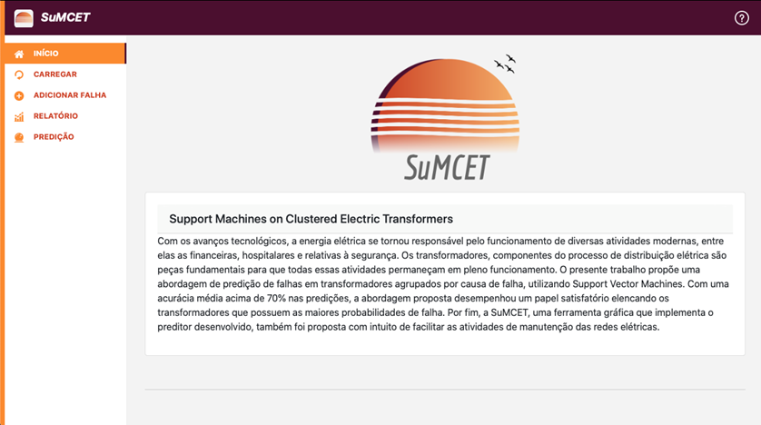

### SuMCET: Support Machines on Clustered Electric Transformers

**Abstract:** With technological advances, electric power became responsible for the operation of several modern activities, including financial, hospital and safety related. Transformers, components of the electrical distribution process, are fundamental parts for all these activities to remain fully operational. The present work proposes a failure prediction approach in transformers grouped by failure cause using Support Vector Machines. With an average accuracy above 70% in predictions, the proposed approach played a satisfactory role in listing the transformers that have the highest failure probability. Finally, the SuMCET, a graphical tool that implements the developed predictor is also being proposed in order to facilitate the maintenance activities of the electric networks.

Paper available att: http://revistas.poli.br/index.php/repa/article/view/1334
